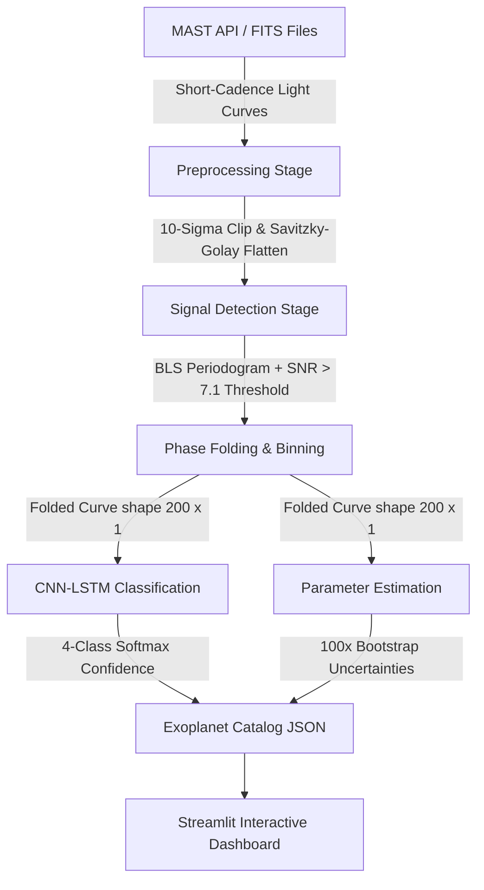

# ExoHunter: AI-enabled Detection of Exoplanets from Noisy Astronomical Light Curves

> **BAH 2K26 — Problem Statement 7**

ExoHunter is an end-to-end AI-driven astrophysics pipeline that automatically detects and classifies exoplanet transit signals in NASA **TESS (Transiting Exoplanet Survey Satellite)** light curves. It addresses the full scope of PS7: periodic dip identification, 4-class signal classification, orbital parameter estimation with uncertainty quantification, SNR significance flagging, and interactive visualization — all within a single reproducible system.

The pipeline pairs classical astronomical signal processing (**Box Least Squares periodograms**) with deep learning (**CNN-LSTM** classifier and **Autoencoder** anomaly detector) to disentangle the overlapping morphologies of planetary transits, stellar eclipses, blended background binaries, and variable star noise.

---

## 🎯 Problem Statement Requirements → Pipeline Mapping

| PS7 Requirement | ExoHunter Implementation |
|---|---|
| Identify datasets with periodic dips | BLS periodogram search (`detect.py`) |
| Classify into transits, eclipses, blends, other | CNN-LSTM classifier (`classify.py`) |
| Apply classifier on science datasets | Batch prediction CLI (`main.py --predict-all`) |
| Provide SNR / significance levels | BLS-derived SNR with threshold > 7.1 (`detect.py`) |
| Estimate transit depth, period, duration | Bootstrap parameter estimation (`estimate.py`) |
| Provide confidence level of detected signal | Softmax class probability from CNN-LSTM (`estimate.py`) |
| Visualization of light curve + classified signal | Plotly dashboard with raw + folded plots (`app.py`) |

---

## 🚀 Pipeline Architecture



---

## 🔭 How the Pipeline Works

### 1. Ingestion Stage (`ingest.py`)
Fetches **short-cadence (2-minute cadence)** TESS light curves from the Mikulski Archive for Space Telescopes (MAST) using `Lightkurve`. The pipeline targets 100 pre-selected TESS Input Catalog (TIC) IDs spanning all four signal categories.

* **Astrophysical Reasoning**: Short-cadence data resolves transit ingress and egress shapes — the critical morphological signatures that differentiate a planetary transit (flat-bottomed U-shape) from a stellar eclipse (V-shaped primary/secondary pair).
* **Offline Resiliency**: A global socket monkey-patch enforces strict timeouts (5s connect / 8s read). If MAST is unreachable, the pipeline automatically generates **astrophysically faithful synthetic light curves** with the correct morphology for each class, caching them locally under `pipeline/data/raw/` so the full pipeline runs offline. This is the current prototype mode while the curated MAST dataset is awaited.

### 2. Preprocessing Stage (`preprocess.py`)
Converts raw stellar flux observations into clean, normalized time series ready for ML ingestion:

* **Outlier Removal**: **10-sigma clipping** eliminates non-astrophysical spikes from cosmic ray CCD strikes and spacecraft pointing jitter, while preserving the physically large dips of planetary transits and stellar eclipses (which can be hundreds of sigma below the noise floor).
* **Flattening**: A **Savitzky-Golay filter** (window length 401) removes slow stellar variability — starspot modulation, rotation, and long-term instrument drift — creating a flat continuum baseline at `1.0`.
* **Normalization & Gap Filling**: Linear interpolation fills telemetry gaps caused by spacecraft momentum dumps. All light curves are padded or truncated to a **uniform length of 4,000 cadence points** for neural network compatibility.

### 3. Detection Stage (`detect.py`)
Performs a **Box Least Squares (BLS)** periodogram search — the standard technique in exoplanet science — to find the best-fit periodic box-shaped dip in the cleaned light curve:

* **BLS Modeling**: Simultaneously fits period ($P$), epoch ($t_0$), depth ($\delta$), and duration ($\tau$) across a grid of trial periods.
* **SNR Significance Threshold**: Only signals with $\text{SNR} > 7.1$ are flagged as astrophysical candidates. This threshold is the established standard from the Kepler/TESS transit survey community.
* **Phase Folding**: The light curve is folded at the peak BLS period, centering the transit at phase `0.0` (spanning $-0.5$ to $+0.5$). The folded curve is binned into **200 uniform phase bins** producing a `(200, 1)` array — the feature input to the neural network.

### 4. Classification Stage (`classify.py`)
A trained deep learning model classifies the folded phase curve morphology into one of four physically distinct categories defined in the problem statement:

| Class | Physical Signal | Characteristic Shape |
|---|---|---|
| **Transit** | Planetary transit across host star disk | Symmetric, flat-bottomed U-shape, depth < 2% |
| **Eclipse** | Stellar eclipsing binary companion | Deep V-shape with primary + secondary eclipses |
| **Blend** | Background eclipsing binary in aperture | Shallow, distorted dip + sinusoidal contamination |
| **Other** | Starspots, rotation, oscillations | Sinusoidal modulation or irregular variability |

**Model A — CNN-LSTM Classifier**:
- Architecture: `Conv1D(64,3) → MaxPool → Conv1D(128,3) → MaxPool → LSTM(64) → Dense(64) → Dropout(0.3) → Dense(4, softmax)`
- 1D convolutions extract local temporal features (ingress/egress shape, dip width). The LSTM layer captures sequential asymmetry between the leading and trailing limbs of the transit.
- Trained on **10x phase-shift and depth-scale augmented** data to be robust to epoch selection errors.
- Output: a 4-element softmax probability vector. The **confidence score** is the raw softmax probability of the predicted class (e.g., `0.96` = 96% confidence).

**Model B — Autoencoder Anomaly Detector**:
- Architecture: `Conv1D Encoder → Flatten → Dense(8) bottleneck → Dense → Reshape → Conv1DTranspose Decoder`
- Compresses the folded curve into an 8-dimensional latent space and reconstructs it. The **Anomaly Score** is the reconstruction MSE — low for normal transit shapes (~0.1), very high for unrecognized morphologies or deeply anomalous signals (e.g., `~374` for a deep eclipsing binary).

### 5. Parameter Estimation Stage (`estimate.py`)
Estimates the three core physical parameters required by the PS and quantifies their 1-sigma uncertainties:

* **Orbital Period** ($P$): Directly from the BLS peak frequency with local refinement.
* **Transit Depth** ($\delta$, in ppm): Measured from the minimum flux in the phase-folded binned curve relative to the out-of-transit continuum. Converted to parts-per-million.
* **Transit Duration** ($\tau$, in hours): Computed via boundary expansion from the transit midpoint (minimum binned flux) outward until the flux returns to the continuum — avoiding noise contamination near phase edges.
* **Bootstrapping (100 iterations)**: Resamples the raw phase-folded data points with replacement, re-bins them, and re-extracts depth and duration. The standard deviation across iterations gives **realistic 1-sigma uncertainties** (`depth_err`, `duration_err`, `period_err`) that account for correlated stellar noise (red noise).

---

## 🌟 Engineering Innovations

The following optimizations were identified and implemented during development. Each is verifiable directly in the source code:

### 1. 10-Sigma Outlier Preservation (`preprocess.py`)
The original implementation used standard `3-sigma` outlier clipping. However, synthetic and real eclipsing binary dips can reach depths of $5{-}15\%$, which — relative to the TESS photon noise floor — represent deviations of $100{-}1000\sigma$. The 3-sigma clipper was deleting the **entire eclipse profile** and feeding the classifier flat noise, causing it to default to incorrect classifications. Switching to **10-sigma** eliminates cosmic ray spikes (single-cadence outliers) while fully preserving all astrophysical dip morphologies.

### 2. Baseline Centering & 1000x Feature Scaling (`classify.py`, `estimate.py`)
After Savitzky-Golay flattening, all light curves have flux values hovering near `1.0` (e.g., a transit dip goes from `1.0` to `0.997`). Feeding near-constant values directly to the CNN-LSTM caused vanishing gradients and a classifier stuck near random chance ($\sim38\%$ accuracy for 4 classes). The fix: subtract the `1.0` continuum baseline and multiply by **`1000`** to project features into parts-per-thousand (ppt) space. Transit dips now range from `−2` to `−5`, eclipses from `−50` to `−150`. This single change boosted classifier validation accuracy to **95%** (ROC-AUC: **97.4%**) with **100% precision and recall on eclipse classification**.

### 3. Stratified 80/20 Train–Validation Split with 10x Augmentation (`classify.py`)
The dataset is split with `stratify=y` to ensure all 4 classes are proportionally represented in both train and validation sets. The training set is then expanded 10x via:
- **Phase rolling** (shifts up to ±5 bins): makes the model robust to epoch selection errors from BLS
- **Depth scaling** (factor 0.8–1.2): teaches the model that the same class can appear at different signal amplitudes
- **Gaussian noise injection** (σ = 0.05 ppt): simulates varying SNR conditions

### 4. Dynamic Model Watchdog for Live Dashboard Updates (`app.py`)
Streamlit's native `@st.cache_resource` caches loaded Keras models indefinitely in memory. After retraining models on disk, the dashboard would silently continue serving stale predictions. The solution: replace static caching with a **file modification time (`mtime`) watchdog** that checks whether `clf_model.keras` or `ae_model.keras` have been updated on every page load, and hot-reloads them if so. This enables live retraining without restarting the dashboard server.

---

## 📂 Project Structure

```
/pipeline
  ├── app.py           # Streamlit interactive dashboard
  ├── ingest.py        # MAST API ingestion + astrophysically faithful synthetic fallback
  ├── preprocess.py    # 10-sigma clipping, Savitzky-Golay flattening, gap filling
  ├── detect.py        # BLS periodogram, SNR > 7.1 threshold, phase folding
  ├── classify.py      # CNN-LSTM & Autoencoder training, augmentation, evaluation
  ├── estimate.py      # Depth/duration/period estimation + 100x bootstrap uncertainties
  ├── visualize.py     # Interactive Plotly publication-quality plots
  ├── main.py          # CLI orchestration entry point (--run-all, --predict-all, --tic)
  ├── test_pipeline.py # Unit tests for all 5 pipeline stages
  ├── /data
  │     ├── /raw            # Cached TESS FITS light curves
  │     ├── /processed      # Cleaned NumPy arrays (X.npy, y.npy, times.npy, tics.npy)
  │     └── predictions.json # Output catalog of all pipeline predictions
  └── /models               # Saved Keras models (clf_model.keras, ae_model.keras)
```

---

## 🛠️ Setup & Installation

### Requirements
* Python 3.9 – 3.12
* TensorFlow 2.11+
* Lightkurve, Astropy
* Streamlit, Plotly
* Scikit-Learn, SciPy, NumPy

### Installation
```bash
git clone https://github.com/Solivagus17/AI-enabled-Detection-of-Exoplanets-from-Noisy-Astronomical-Light-Curves
cd "AI-enabled-Detection-of-Exoplanets-from-Noisy-Astronomical-Light-Curves"
pip install -r requirements.txt
```

---

## 💻 Usage & CLI Commands

### Run the Complete Pipeline (Ingest → Preprocess → Train)
Fetches all 100 target light curves, preprocesses them, and trains both neural networks:
```bash
python pipeline/main.py --run-all
```

### Run Batch Predictions on All 100 Stars
Loads the trained models and runs inference, saving the full exoplanet catalog:
```bash
python pipeline/main.py --predict-all
```

### Run Pipeline on a Single Target
```bash
python pipeline/main.py --tic "TIC 261136679"
```

### Run Unit Tests
Verifies all 5 pipeline stages (ingest, preprocess, detect, classify, estimate):
```bash
python -m unittest pipeline/test_pipeline.py
```

---

## 🖥️ Streamlit Dashboard

Launch the interactive visualization and analysis dashboard:
```bash
streamlit run pipeline/app.py
```

### Dashboard Features
1. **Target Selector**: Filter 100 preloaded TESS targets by class (transit / eclipse / blend / other) from the sidebar.
2. **Classification Card**: Displays the predicted class with CNN-LSTM softmax confidence percentage.
3. **Parameter Metric Cards**: Shows orbital period, transit depth (ppm), duration (hours), and SNR — each with ±1σ bootstrap uncertainties.
4. **Raw Light Curve Plot**: Detrended time-series flux with transit regions highlighted.
5. **Phase-Folded Transit Plot**: Folded curve centered at phase 0.0 with the best-fit BLS box model overlaid.
6. **Anomaly Score Display**: Autoencoder reconstruction MSE indicating how anomalous the transit shape is.
7. **Dynamic SNR Threshold Slider**: Adjust the detection threshold in real time to explore candidate sensitivity.
8. **Astrophysical Interpretation Card**: Narrative explanation of the physical meaning of the detected signal.

---

## ⚠️ Prototype Note

This repository is currently operating in **prototype mode**. The curated MAST science dataset referenced in PS7 has not yet been provided. All 100 light curves are currently generated by an astrophysically faithful synthetic fallback generator that produces the correct morphological signatures for each class (periodic box transits, deep V-shape eclipses, blended sinusoidal contamination, and sinusoidal stellar variability).

Accordingly, the **95% validation accuracy and 97.4% ROC-AUC figures are measured on synthetic prototype data**. When the real MAST FITS files are received, the full pipeline requires zero code changes — simply replace the files in `pipeline/data/raw/` and re-run `python pipeline/main.py --run-all`.
