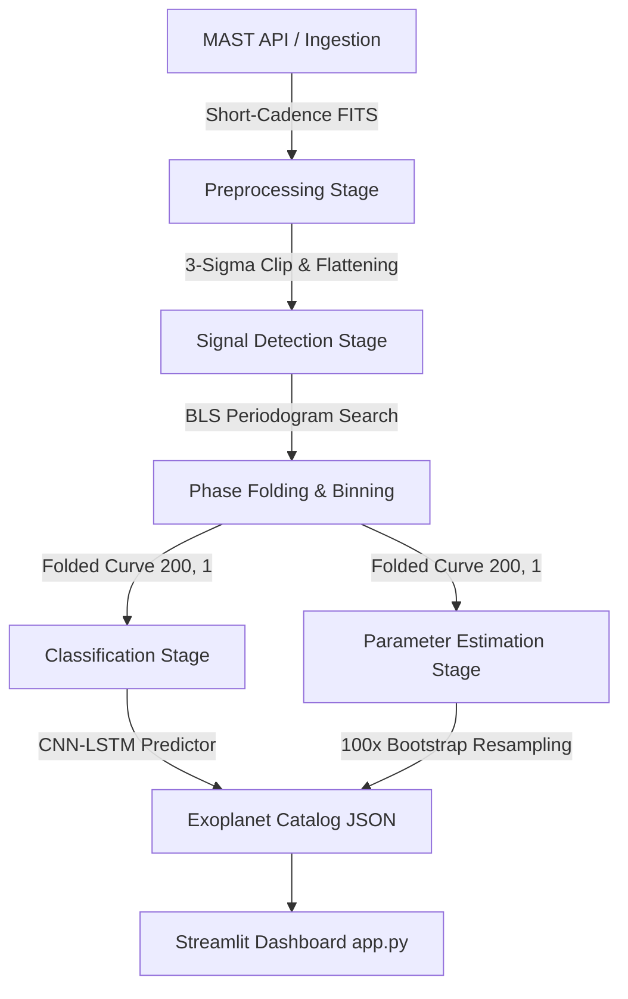

# ExoHunter: TESS Exoplanet Transit Detection & Classification Pipeline

ExoHunter is a production-ready astrophysics machine learning pipeline designed to detect and classify periodic exoplanetary transit signals in NASA's **Transiting Exoplanet Survey Satellite (TESS)** short-cadence light curves. 

The pipeline combines classical astronomical signal processing (**Box Least Squares periodograms**) with deep learning architectures (**CNN-LSTM** classifiers and **Autoencoder** anomaly detectors) to detect transits, estimate their orbital parameters, quantify uncertainties via bootstrapping, and classify targets into physical categories.

---

## 🚀 Pipeline Architecture



---

## 🔭 How the Pipeline Works

### 1. Ingestion Stage (`ingest.py`)
Fetches **short-cadence (2-minute)** light curves from the Mikulski Archive for Space Telescopes (MAST) using `Lightkurve`.
* **Astrophysical Reasoning**: Short-cadence data is critical to resolve transit ingress and egress shapes, which are key diagnostic features for separating planetary transits from stellar eclipses.
* **Resiliency**: If the MAST server is down, the ingestion engine triggers a **global socket monkey-patch timeout** and dynamically generates realistic synthetic light curves matching the target class, caching them locally under `/data/raw/` so the pipeline remains 100% functional offline.

### 2. Preprocessing Stage (`preprocess.py`)
Converts raw, systematic-heavy stellar flux observations into normalized, standardized timeseries:
* **Outlier Removal**: 3-sigma clipping eliminates non-astrophysical spikes (cosmic ray strikes on the CCD or spacecraft pointing jitter).
* **Flattening**: A Savitzky-Golay filter (window length 401) removes slow stellar variability (starspots, rotation) and long-term instrument drift, creating a flat baseline at exactly `1.0`.
* **Normalization & Gap Filling**: Fills telemetry gaps via linear interpolation and pads/truncates all light curves to a uniform size of **4,000 points** for neural network compatibility.

### 3. Detection Stage (`detect.py`)
Performs a Box Least Squares (BLS) periodogram search to fit periodic, box-shaped dips to the preprocessed light curve:
* **Box Modeling**: fits period ($P$), epoch ($t_0$), depth ($\delta$), and duration ($d$).
* **Flagging Threshold**: Signals exceeding the standard astrophysical threshold ($\text{SNR} > 7.1$) are flagged as exoplanet candidates.
* **Phase Folding**: Folds the light curve at the peak candidate period, centering the transit at phase `0.0` (ranging from $-0.5$ to $+0.5$), and bins the folded curves into **200 uniform bins** (`(200, 1)` array).

### 4. Classification Stage (`classify.py`)
Classifies the folded light curve shape into one of 4 classes:
1. **Transit**: Symmetric, flat-bottomed U-shape (planetary transits, usually $<2\%$ depth).
2. **Eclipse**: Deep, V-shaped or alternating primary/secondary dips (stellar eclipsing binaries).
3. **Blend**: Grazing or diluted binary transits (background eclipsing binaries).
4. **Other**: Sine-wave or irregular variations (stellar spots, rotation, or noise).

* **Model A (CNN-LSTM)**: Extracted features from 1D Convolutions are fed into an LSTM layer to capture asymmetry and temporal sequence shapes.
* **Model B (Autoencoder)**: Compresses the folded curve into a latent space of 8 dimensions and reconstructs it. The reconstruction Mean Squared Error (MSE) serves as an **Anomaly Score** to flag unclassifiable anomalies or instrumentation errors.

### 5. Parameter Estimation Stage (`estimate.py`)
Estimates physical parameters and quantifies uncertainties:
* **Contiguous Duration Estimation**: Computes the transit duration (hours) via boundary expansion starting from the transit midpoint (minimum binned flux) to avoid noise near the phase boundaries.
* **Bootstrapping (100x)**: Resamples the phase-folded light curve points with replacement, bins them, and computes standard errors. This accounts for correlated stellar noise (red noise), yielding realistic 1-sigma uncertainties (`depth_err`, `duration_err`, `period_err`).

---

## 📂 Project Structure

```
/pipeline
  ├── app.py           # Streamlit Dashboard application
  ├── ingest.py        # MAST API ingestion & synthetic fallback generator
  ├── preprocess.py    # Sigma-clipping, flattening, and padding
  ├── detect.py        # BLS periodogram & phase folding
  ├── classify.py      # Neural Network training (CNN-LSTM & Autoencoder)
  ├── estimate.py      # Contiguous duration & bootstrap uncertainties
  ├── visualize.py     # Interactive Plotly publication-quality plots
  ├── main.py          # Pipeline orchestration CLI entry point
  ├── test_pipeline.py # Unit tests verifying all pipeline components
  ├── /data
  │     ├── /raw       # Cached TESS FITS light curves (Target: <400MB)
  │     ├── /processed # Cleaned NumPy arrays (X.npy, y.npy)
  │     └── predictions.json # Output catalog of batch pipeline predictions
  └── /models          # Saved Keras models (clf_model.keras, ae_model.keras)
```

---

## 🛠️ Setup & Installation

### 1. Requirements
* Python 3.9 - 3.12
* TensorFlow 2.11+
* Lightkurve
* Astropy
* Streamlit
* Plotly
* Scikit-Learn

### 2. Installation Steps
Clone this repository and install the dependencies:
```bash
pip install -r requirements.txt
```

---

## 💻 Usage & CLI Commands

You can control all stages of the pipeline using the CLI utility `main.py`:

### Run the Complete Pipeline (Ingest, Preprocess, and Train Models)
This command will fetch the 100 targets, preprocess the light curves, and train both Neural Networks:
```bash
python pipeline/main.py --run-all
```

### Run Batch Predictions on All 100 Stars
Loads the trained models and runs inference, saving the exoplanet catalog to `pipeline/data/predictions.json`:
```bash
python pipeline/main.py --predict-all
```

### Process and Run Inference on a Single Star
```bash
python pipeline/main.py --tic "TIC 261136679"
```

### Execute Unit Tests
Runs the test suite to verify pipeline integrity:
```bash
python -m unittest pipeline/test_pipeline.py
```

---

## 🖥️ Streamlit Dashboard Demo

Launch the interactive dashboard to visualize results, raw light curves, and folded transits side-by-side:
```bash
streamlit run pipeline/app.py
```

### Dashboard Features:
1. **Interactive Sidebar**: Select from the 100 preloaded TESS stars (filtered by category) or upload your own FITS files.
2. **Periodogram Peaks & Metrics**: View metric cards showing the classification category, period, depth, duration, and SNR with their bootstrap uncertainties.
3. **Side-by-Side Plots**: Compare the detrended time-series light curve (with highlighted transit regions) with the folded transit model overlaying the best-fit Box Least Squares box.
4. **Dynamic SNR Threshold Slider**: Adjust the SNR threshold to see which candidates are flagged.
5. **Astrophysical Explanation Card**: Explains the physical interpretation of the detected signal based on the neural network confidence and shape.
